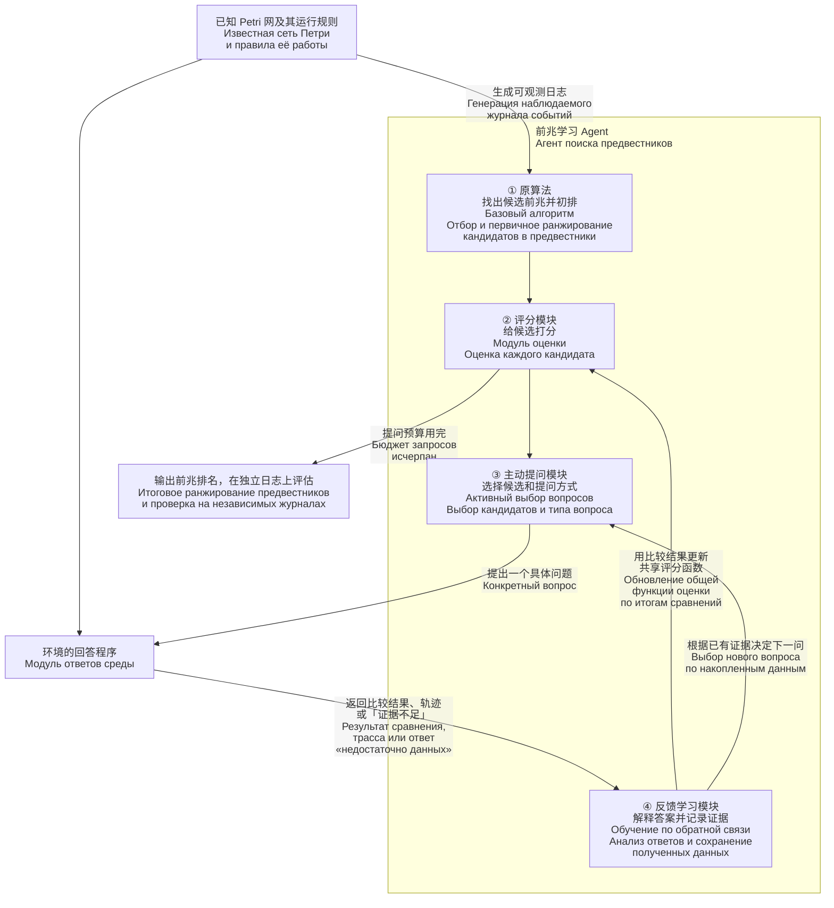

# 前兆主动学习框架 / Схема активного обучения для поиска предвестников

```mermaid
---
config:
  htmlLabels: false
  flowchart:
    wrappingWidth: 340
    nodeSpacing: 100
    rankSpacing: 80
    subGraphTitleMargin:
      top: 12
      bottom: 36
---
flowchart TD
    N["已知 Petri 网及其运行规则<br/>Известная сеть Петри<br/>и правила её работы"] -->|"生成可观测日志<br/>Генерация наблюдаемого<br/>журнала событий"| B

    subgraph Agent["前兆学习 Agent<br/>Агент поиска предвестников"]
        B["① 原算法<br/>找出候选前兆并初排<br/>Базовый алгоритм<br/>Отбор и первичное ранжирование<br/>кандидатов в предвестники"] --> S["② 评分模块<br/>给候选打分<br/>Модуль оценки<br/>Оценка каждого кандидата"]
        S --> Q["③ 主动提问模块<br/>选择候选和提问方式<br/>Активный выбор вопросов<br/>Выбор кандидатов и типа вопроса"]
        U["④ 反馈学习模块<br/>解释答案并记录证据<br/>Обучение по обратной связи<br/>Анализ ответов и сохранение<br/>полученных данных"]
        U -->|"用比较结果更新<br/>共享评分函数<br/>Обновление общей<br/>функции оценки<br/>по итогам сравнений"| S
        U -->|"根据已有证据决定下一问<br/>Выбор нового вопроса<br/>по накопленным данным"| Q
    end

    N --> O["环境的回答程序<br/>Модуль ответов среды"]
    Q -->|"提出一个具体问题<br/>Конкретный вопрос"| O
    O -->|"返回比较结果、轨迹<br/>或「证据不足」<br/>Результат сравнения,<br/>трасса или ответ<br/>«недостаточно данных»"| U
    S -->|"提问预算用完<br/>Бюджет запросов<br/>исчерпан"| V["输出前兆排名，在独立日志上评估<br/>Итоговое ранжирование предвестников<br/>и проверка на независимых журналах"]
```
